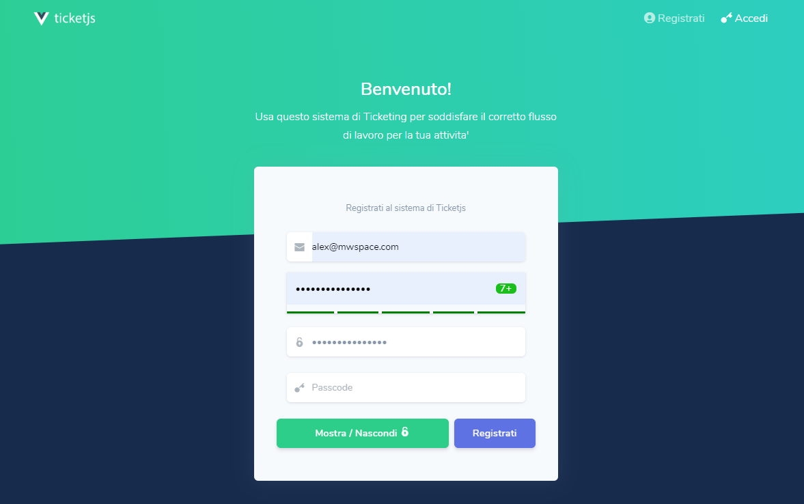

ticketJs

## About MwSpace
MwSpace LLC is a most advanced brand for develop any idea e/o startup. Our business is to boost any company with our services (SASS, PASS, IASS).

### 🕹 Why ?
This product help many companies to manage work with simple ticket system.
No mounthly cost, only deploy app on cloud, & work every u want! 

see [Old Php Version](https://github.com/MwSpaceLLC/tickets)

### 👛 Important !! 

This repo NOT stable

### 🛒 Requirement
- Yarn Manager
- Nodejs server pract
- Vuejs Frontend pract
- MySql Datasource pract

### 🥋 Contributing
Thank you for considering contributing to the Tickets Project, if u want to hep us, 
u can become a [Patreon] (https://www.patreon.com/user?u=24519588)

### 🎖 Security & Tug Track
If you discover a security vulnerability within Tickets, please send an e-mail to support via [support@mwspace.com](mailto:support@mwspace.com). All security vulnerabilities will be promptly addressed.

### 🔋 License
The ticketJs is open-source software licensed under the [MIT license](https://opensource.org/licenses/MIT).

### ⌨ First Install ?

1) Set all field in *.env* file
2) Import latest relese sql structure from [dbdiagram.io](https://dbdiagram.io/d/5d9e2b9bff5115114db51501)

        yarn install
        
        yarn server

        yarn dev
    
### 🔫 Trick & Knows

U 09/10/19
- Added mysql support
- database structure

N relese
1) Nodejs
1) Vuejs
1) Mysql
1) Bootstrap

Other Futures cooming soon !

### 🔮 Control Updates

    silence are gold